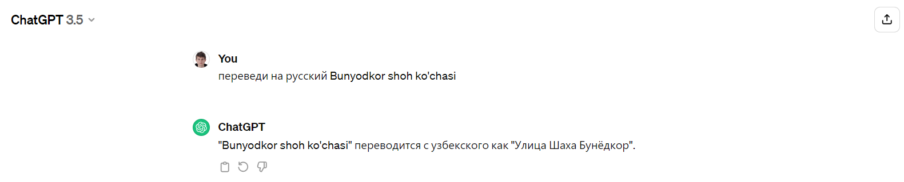

# Как получить список всех адресов в городе

> Нужна машина на linux (Ubuntu 22.04.2 LTS x86_64), минимум 16gb оперативной памяти и 500gb на жестком диске

## Дампим адреса

0. Гуглим `openstreetmap dump adresses`

1. Скачиваем и собираем [addressextract](https://github.com/flohoff/addressextract)

2. Скачиваем и собираем [Osmconvert](https://wiki.openstreetmap.org/wiki/Osmconvert)

3. Скачиваем [planet.osm](https://planet.openstreetmap.org/) в формате `*.pbf`

4. Получаем город в [openstreetmap.org/relation](https://www.openstreetmap.org/relation/2216724#map=11/41.2931/69.2993). Нажмите экспорт, скопируйте координату из ссылки для пункта 5

5. Запускаем команду `./osmconvert planet*.pbf -b=ЛЕВО,НИЗ,ВЕРХ,ПРАВО -o output.pbf` (например: `./osmconvert planet*.pbf -b=69.0547,41.1949,69.5433,41.3908 -o=output.pbf`), примерно час времени

6. Запускаем команду `./addressextract/addressextract -i output.pbf > addresses.json`

7. Добавляем пробелы и переносы строк (опционально) `npx prettier -w ./addresses.json`

8. Высчитываем общий набор полей `node -e "console.log(require('./addresses.json').addresses.reduce((acm, cur) => ({...acm, ...cur}), {}))"`

## Сериализуем структуру в адрес

```javascript
{
  bbox: [ 69.2036071, 41.2533611, 69.2037432, 41.2534634 ],
  geomcounty: 'Chilonzor Tumani',
  id: '1182666580',
  lat: '41.253412',
  lon: '69.203675',
  source: 'way',
  street: "Bunyodkor shoh ko'chasi",
  housenumber: '1',
  city: 'Ташкент',
  postcode: '100000',
  place: 'Chilonzor 20 mavze',
  housename: "Bahtiyor Do'koni"
}
```

Нужно

1. `city`- город
2. `geomcounty` - район
3. `place` - квартал
4. `street` - улица
5. `housename` - имя дома (опционально)
6. `housenumber` - номер дома

Не нужно

7. `postcode` - почтовый код (опционально)

## Дополнительно

P.S. проблемы с `addressextract`, так как `libgdal30` выпилили из репо Ubuntu 23.10. Ежели чем пытаться установить или запуститься из-под докера, проще пересобраться, там буквально 3 минуты делов если без виртуалки

## Переводим на русский


